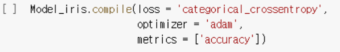

# 딥러닝

## Neural Network

- 머신러닝 분야에서 연구되는 학습 알고리즘

- 인간의 뇌 구조를 모방해 만들어짐
  - 수상돌기 : input(X), 축색 : output(y_hat)


### Perceptron

- 인공 신경망의 한 종류(**선형 분리기**)

- 입력값(X)과 가중치(w)의 곱을 모두 합함 sig(xw+b)
- 합한 값이 활성화 함수의 임계치(0.5)보다 크면 1 작으면 0
  - AND : A  and B 가 참(1) 일 경우만 참(1)
  - OR : 1개라도 참이 있으면 참
  - NAND :  A and B가 참(1) 일경우만 거짓(0)
  - XOR : A와 B를 받아 입력 값이 같으면 0을 출력하고, 입력 값이 다르면 참(1)


**XOR는 선이 2개가 필요하기 때문에 여러개의 Perceptron을 연결하면 해결 가능** 


### Multi-Layer Perceptron(MLP) : 여러개의 perceptron을 연결하여 더 복잡한 문제 해결

- 퍼셉트론으로 해결할 수 없는 비선형 분리 문제에 필요
- 여러층(Layer)의 퍼셉트론(Node)을 쌓아서 동작(Input(X) - Hidden(함수) - Output)
  - 하나의 함수를 더 잘 쓰려고 하는 것보다 여러개의 함수로 문제해결
- 모든 노드(함수)들이 서로 연결됨


**Tensor**

- Multi Dimensional Matrix

```python
Multi Dimensional Matrix

def Machine(x1, x2,
           w1_11, w1_12, b1_1,
           w1_21, w1_22, b1_2,
           w2_11, w2_12, b2_1):
    y1 = sigmoid(x1 * w1_11 + x2 * w1_12 + b1_1)
    y2 = sigmoid(x1 * w1_21 + x2 * w1_22 + b1_2)
    
    y_hat = sigmoid(y1 * w2_11 + y2 * w2_12 + b2_1)
    return y_hat
```


#### MLPClassfier() 

```python
from sklearn.neural_network import MLPClassfier
```

- MLPClassfier()
  - hidden_layer_size = () : 은닉층 노드의 개수
  - activation = ' ' : 활성화 함수
  - solver = ''  : 최적화 기법
  - max_iter = : 학습 반복 횟수


- 이진분류 sigmoid

- 다중분류 softmax(y_hat) : 각각의 확률값(y_hat) 합이 1이 됨

  - Output layer에서 softmax를 사용하는게 더 효율적으로 성능을 낸다

  - CEE(Cross_Entropy_Error) : -SUM(y*log(y_hat))

---

만약 Parameter 갯수가 100만개 이상이라면 수치미분으로 가능한가?

- 가능하다 해도 많은 컴퓨팅 자원과 시간이 소요
- 학습시간에 부정적인 영향을 끼침


### Error Backpropagation

- 학습 : Parameter(w,b) Update
- 학습원리 : Gradient Descent(경사하강법) 

**오차(y-y_hat)역전파 알고리즘 : 미분을 안하고 미분값을 획득가능**


#### Chain Rule

- 신경망은 함수가 연결된 것

- Neural Network는 간단한 함수들의 중첩(합성 함수)으로 구성
- 합성 함수 미분은 개별 함수 미분의 곱으로 처리


#### Backpropagation Algorithm

- 연쇄법칙 적용

  **오차값 * 출력값(1-출력값)*입력값 반복**


- Forward Propagation으로 y값 구하고, 

  Backpropagation으로 파라미터 업데이트 반복


#### Vanishing Gradient

- sigmoid 함수를 미분하면 최대치가 0.25로 `보다 작은값 생성
- 은닉층 증가 시 미분값(기울기)가 0이 되는 문제 발생
- Activation Function(Sigmoid)을 다른 함수(Tanh, ReLu, Leaky ReLU)로 대체해 학습


## <u>Optimization Method</u>

- 경사하강식을 더 잘 활용하기위한 방식

### 확률적 경사하강(SGD : Stochastic Gradient Descent)

- 전체 데이터(batch) 대신 일부 데이터(mini-batch)를 사용
- batchGD 보다 정확도는 낮지만 계산속도가 훨씬 빠름


### 관성 Momentum

- 이동 과정에 '관성'을 반영
- 현재 이동 방향과 별개로 과거 방식에 가중치를 주며 이동


### Adaptive Gradient(Adagrad)

- 학습 횟수가 증가함에 따라 학습률 조절
- 학습률(Learning Rate)이 작으면 안정적이지만 학습속도 느려짐


### Adam(Adaptive Moment Estimation)

- Stochastic, Momentum, Adaptive 의 장점을 합친 알고리즘


## TensorFlow

- TensorFlow = 행렬의 흐름
  - 실수행렬만 input으로 받음(실수, floating point)

- 데이터 흐름 프로그래밍을 위한 Open Source Software Library


### Tensor

- Tensor in NLP(Natural Language Processing)
  - 문장과 단어를 숫자 벡터로 매핑(원핫인코딩)
- Tensor in Grayscale Image
  - (3,5,5) : Rank3 Tensor
  - (Number of Images, Rows, Columns)

- Tensor in RGB Color Image
  - (3,5,5,3)  : Rank 4 Tensor
  - (Number of Images, Rows, Columns, RGB Channel)

- Tensor in RGB Color Video
  - (3,5,600,800,3) : Rank 5 Tensor
  - (Video Frames, Number of Images, Rows, Columns, RGB Channel)


### Keras Modeling

- Define(신경망 구조 정의)
- Compile(학습방법 설정)
- Fit(모델 학습 수행)
- Evaluate(모델 평가)

- Predict(모델 적용)


**모델학습방법 **



- 수치예측 : MSE

- 측정 : 수치예측일 때 metrics = []'MSE']