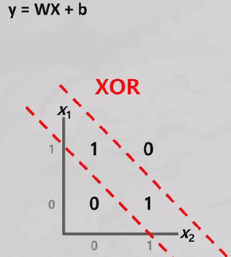

# 딥러닝

## Neural Network

- 머신러닝 분야에서 연구되는 학습 알고리즘

- 인간의 뇌 구조를 모방해 만들어짐
  - 수상돌기 : input(X), 축색 : output(y_hat)


### Perceptron

- 인공 신경망의 한 종류(**선형 분리기**)

- 입력값(X)과 가중치(w)의 곱을 모두 합함 sig(xw+b)
- 합한 값이 활성화 함수의 임계치(0.5)보다 크면 1 작으면 0
  - and : A  and B 가 참(1) 일 경우만 참(1)
  - or : 1개라도 참이 있으면 참
  - nand :  A and B가 참(1) 일경우만 거짓(0)
  - xor : A와 B를 받아 입력 값이 같으면 0을 출력하고, 입력 값이 다르면 참(1)



​			**XOR는 선이 2개가 필요하기 때문에 여러개의 Perceptron을 연결하면 해결 가능** 


### Multi-Layer Perceptron(MLP) : 여러개의 perceptron을 연결하여 더 복잡한 문제 해결

- 퍼셉트론으로 해결할 수 없는 비선형 분리 문제에 필요
- 여러층(Layer)의 퍼셉트론(Node)을 쌓아서 동작(Input(X) - Hidden(함수) - Output)
  - 하나의 함수를 더 잘 쓰려고 하는 것보다 여러개의 함수로 문제해결
- 모든 노드(함수)들이 서로 연결됨


**Tensor**

- Multi Dimensional Matrix

```python
Multi Dimensional Matrix

def Machine(x1, x2,
           w1_11, w1_12, b1_1,
           w1_21, w1_22, b1_2,
           w2_11, w2_12, b2_1):
    y1 = sigmoid(x1 * w1_11 + x2 * w1_12 + b1_1)
    y2 = sigmoid(x1 * w1_21 + x2 * w1_22 + b1_2)
    
    y_hat = sigmoid(y1 * w2_11 + y2 * w2_12 + b2_1)
    return y_hat
```


#### MLPClassfier() 

```python
from sklearn.neural_network import MLPClassfier
```

- MLPClassfier()
  - hidden_layer_size = () : 은닉층 노드의 개수
  - activation = ' ' : 활성화 함수
  - solver = ''  : 최적화 기법
  - max_iter = : 학습 반복 횟수

